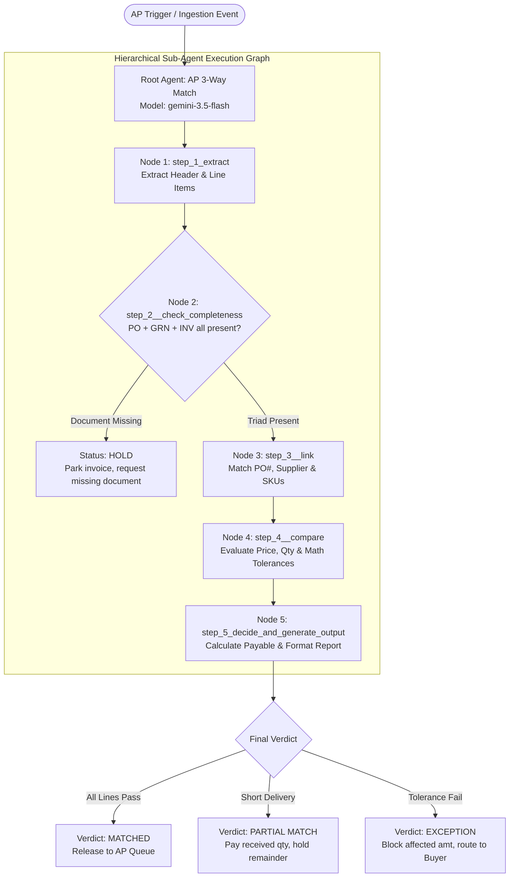

# AP 3-Way Match — Enterprise Accounts Payable Reconciliation Agent

An enterprise autonomous AI agent built on the **Google Cloud Gemini Enterprise Agent Platform** (Discovery Engine) that automates the accounts payable reconciliation process by performing strict, multi-step **3-Way Matching** across **Purchase Orders (PO)**, **Goods Receipt Notes (GRN)**, and **Supplier Invoices (INV)**.

The agent enforces corporate procurement policies, validates financial math and unit pricing within policy tolerances, eliminates duplicate and phantom payments, calculates approved-to-pay amounts for short receipts, and routes actionable exceptions to procurement buyers.

---

## 📌 Table of Contents

1. [Executive Summary & Business Value](#-executive-summary--business-value)
2. [Gemini Enterprise Agent Architecture](#-gemini-enterprise-agent-architecture)
3. [Multi-Agent Node Graph & Execution Flow](#-multi-agent-node-graph--execution-flow)
4. [🛠️ Step-by-Step Setup in Agent Designer (Gemini Enterprise)](#️-step-by-step-setup-in-agent-designer-gemini-enterprise)
5. [The Document Triad](#-the-document-triad)
6. [Policy Tolerances & Mathematical Rules](#-policy-tolerances--mathematical-rules)
7. [Decision & Routing State Machine](#-decision--routing-state-machine)
8. [Standardized Output & Reconciliation Report](#-standardized-output--reconciliation-report)
9. [Sample Evaluation Dataset (`SampleData/`)](#-sample-evaluation-dataset-sampledata)
10. [Identity, Governance & MCP Egress Security](#-identity-governance--mcp-egress-security)
11. [Knowledge Base & Configuration Artifacts](#-knowledge-base--configuration-artifacts)

---

## 🎯 Executive Summary & Business Value

In corporate procurement, Accounts Payable (AP) should never disburse funds solely on the receipt of an invoice. Before issuing payment, finance operations must reconcile:
- **What was contracted and approved?** &rarr; **Purchase Order (PO)**
- **What was physically delivered and inspected?** &rarr; **Goods Receipt Note (GRN)**
- **What is the supplier billing for?** &rarr; **Supplier Invoice (INV)**

```
┌────────────────────────┐      ┌────────────────────────┐
│  Purchase Order (PO)   │      │ Goods Receipt Note (GRN)│
│  • Authorized commit   │      │ • Verified delivery    │
│  • Agreed unit price   │      │ • Inspected quantity   │
└───────────┬────────────┘      └───────────┬────────────┘
            │                               │
            └───────────────┬───────────────┘
                            ▼
               ┌────────────────────────┐
               │    AP 3-Way Match      │◄─────── ┌────────────────────────┐
               │  Reconciliation Agent  │         │  Supplier Invoice (INV)│
               └────────────┬───────────┘         │  • Payment claim       │
                            │                     │  • Billed quantities   │
                            ▼                     └────────────────────────┘
          ┌───────────────────────────────────┐
          │  MATCHED / EXCEPTION / HOLD       │
          │  • Line-level variance auditing   │
          │  • Dynamic short-receipt pay      │
          │  • Automated buyer routing        │
          └───────────────────────────────────┘
```

### Business Impacts:
- **Eliminate Overpayments**: Automatically flags and blocks price inflation above agreed PO line rates.
- **Prevent Payment for Unreceived Goods**: Enforces zero tolerance for over-billing beyond physical warehouse receipt.
- **Dynamic Short-Receipt Settlement**: Automatically calculates payable amounts for partial deliveries while withholding the unfulfilled balance.
- **Zero Hallucination Mandate**: Strictly grounds extractions in document bytes without inferring unstated values.

---

## 🏗️ Gemini Enterprise Agent Architecture

The agent is deployed within Google Cloud's **Gemini Enterprise Agent Platform** (Discovery Engine) utilizing **Gemini 3.5 Flash** for rapid multimodal document ingestion, OCR parsing, and policy evaluation.

```
Discovery Engine / Gemini Enterprise Agent Platform
├── Agent ID: 12929245980641936153
├── Display Name: AP 3-Way Match
├── LLM Foundation Model: gemini-3.5-flash
├── State: PRIVATE / PUBLISHED
├── Observability: Enabled (Sensitive Logging Active)
├── Data Store: Google Drive Integration (projects/851970768145/.../dataStores/jddrive_google_drive)
└── Grounded Knowledge Base: 3-way-matching-policy.pdf
```

---

## 🔄 Multi-Agent Node Graph & Execution Flow

The solution implements a hierarchical multi-agent graph with a Root Orchestrator delegating to 5 specialized sub-agent nodes:



### Node Specifications

| Node ID | Display Name | Role & System Prompt Contract |
| :--- | :--- | :--- |
| `root_agent` | **AP 3-Way Match** | Coordinates execution across sub-agents. Reads document folders from Google Drive (`PO`), applies `3-way-matching-policy.pdf` knowledge base, and strictly forbids hallucinating values. |
| `step_1_extract` | **Step 1 - Extract** | Pulls header metadata (`supplier_name`, `po_number`, `invoice_number`) and line items `{item_code, description, qty, unit_price}`. Identifies document types. |
| `step_2__check_completeness` | **Step 2 - Check Completeness** | Validates presence of complete triad (`PO`, `GRN`, `INV`). If any document is missing, immediately halts execution with `HOLD`. |
| `step_3__link` | **Step 3 - Link** | Verifies header alignment (identical PO reference and supplier name). Links line items across documents using `item_code` / SKU (falls back to exact `description`). |
| `step_4__compare` | **Step 4 - Compare** | Performs mathematical audit: unit price variance, quantity billed vs received, and total line extension recomputation. |
| `step_5_decide_and_generate_output` | **Step 5 - Decide & Output** | Determines verdict (`MATCHED`, `EXCEPTION`, `HOLD`), calculates payable amounts (including short receipt handling), and generates structured markdown report. |

---

## 🛠️ Step-by-Step Setup in Agent Designer (Gemini Enterprise)

Follow these instructions to configure and deploy the **AP 3-Way Match** agent in Google Cloud's **Gemini Enterprise Agent Platform** (Discovery Engine) using the low-code visual **Agent Designer**.

### Prerequisites
1. **Gemini Enterprise Platform Instance**: An active Gemini Enterprise assistant in your GCP project (e.g. `bold-kit-384717`).
2. **Google Drive Data Store**: A configured Discovery Engine Data Store connected to your Google Drive folder named `PO` (containing supplier subfolders with PO, GRN, and INV PDFs).
3. **Policy Knowledge Document**: Ensure [`3-way-matching-policy.pdf`](file:///Users/prothiag/code/agents/3-way-matching%20Agent/3-way-matching-policy.pdf) is available locally for upload.

---

### Step 1: Create a New Agent in Agent Designer

1. In the **Google Cloud Console**, navigate to **Gemini Enterprise** &rarr; **Assistants** &rarr; **Agents**.
2. Click **+ Create Agent**.
3. In the creation wizard:
   - **Agent Name**: `AP 3-Way Match`
   - **Description**: `Reconciles a purchase order, a goods receipt note, and a supplier invoice`
   - **Designer Mode**: Select **Low-Code Visual Canvas (Agent Designer)**.
   - **Foundation Model**: Select **`gemini-3.5-flash`**.
4. Click **Create** to open the canvas editor.

---

### Step 2: Configure the Root Coordinator Node (`root_agent`)

1. Click on the root node on the canvas (named `AP 3-Way Match`).
2. In the right-hand **Configuration Panel**, configure the following:
   - **Display Name**: `AP 3-Way Match`
   - **Node ID**: `root_agent`
   - **Model**: `gemini-3.5-flash`
   - **Description**: `Reconciles a purchase order, a goods receipt note, and a supplier invoice`
   - **System Instruction**:
     ```text
     You are an accounts-payable 3-way matching agent.

     Read the documents from Google Drive folder named PO - go through each subfolder and review three documents for each purchase: a purchase order (PO), a goods receipt note (GRN), and a supplier invoice. Reconcile them using the tolerances in your "3-way matching policy" knowledge document. Never invent values — only use what appears in the documents.
     ```
3. **Attach Knowledge Base**:
   - Under **Agent Files / Knowledge**, click **Upload File**.
   - Upload [`3-way-matching-policy.pdf`](file:///Users/prothiag/code/agents/3-way-matching%20Agent/3-way-matching-policy.pdf).
4. **Connect Data Store**:
   - Under **Data Stores**, click **+ Add Data Store**.
   - Select your Google Drive data store (e.g. `jddrive_google_drive`).
5. **Tool Restrictions**:
   - Toggle **Google Search** to **Disabled** (guarantees zero external hallucinations; grounds decisions strictly in uploaded documents).

---

### Step 3: Add and Configure the 5 Sub-Agent Nodes

On the Agent Designer canvas, click **+ Add Node** (LLM Agent Node) to create each of the 5 specialized sub-agents:

#### Node 1: Extract Header & Line Items
- **Node ID**: `step_1_extract`
- **Display Name**: `Step 1- Extract`
- **Model**: `gemini-3.5-flash`
- **Description**: `Extract information`
- **Instruction**:
  ```text
  From each document pull: supplier name, PO number, and every line item as {item_code, description, qty, unit_price}. Note the document type of each file.
  ```
- **Google Search**: Disabled

#### Node 2: Completeness Validation
- **Node ID**: `step_2__check_completeness`
- **Display Name**: `Step 2 - Check Completeness`
- **Model**: `gemini-3.5-flash`
- **Description**: `Check completeness`
- **Instruction**:
  ```text
  If any of PO, GRN, or invoice is missing, stop and return HOLD, naming the missing document. Do not approve anything
  ```
- **Google Search**: Disabled

#### Node 3: Header Link & Line Matching
- **Node ID**: `step_3__link`
- **Display Name**: `Step 3 - Link`
- **Model**: `gemini-3.5-flash`
- **Description**: `Match Lines`
- **Instruction**:
  ```text
  Confirm the invoice and GRN reference the same PO number as the PO, and that the supplier matches. Match lines across documents by item_code (fall back to description).
  ```
- **Google Search**: Disabled

#### Node 4: Tolerance & Mathematical Comparison
- **Node ID**: `step_4__compare`
- **Display Name**: `Step 4 - Compare`
- **Model**: `gemini-3.5-flash`
- **Description**: `Compare each line`
- **Instruction**:
  ```text
  Compare each invoiced line and apply the policy tolerances: - Price check: |invoice unit_price − PO unit_price| within ±2% or $0.05 (greater of). - Quantity check: invoice billed qty must be ≤ GRN received qty. - Amount check: qty × unit_price recomputes within ±$1.00. - Item check: the invoiced item exists on the PO.
  ```
- **Google Search**: Disabled

#### Node 5: Decision Matrix & Output Formatting
- **Node ID**: `step_5_decide_and_generate_output`
- **Display Name**: `Step 5  Decide and Generate Output`
- **Model**: `gemini-3.5-flash`
- **Description**: `Agent that handles a specific task`
- **Instruction**:
  ```text
  DECIDE.

    - MATCHED: all checks pass on all lines → approve for payment.
    - EXCEPTION: any check fails → block the affected amount, route to buyer.
    - For a short receipt (received < billed), approve only received qty × PO unit price and hold the remainder.

  OUTPUT: a short verdict header (MATCHED / EXCEPTION / HOLD) and recommended action, then a per-line table with: item, PO qty, received qty, billed qty, PO price, billed price, each check (pass/fail), variance, and approved-to-pay amount. End with a one-line reason for any exception. Be concise and factual.
  ```
- **Google Search**: Disabled

---

### Step 4: Wire Sub-Agent Delegations

1. Select the `root_agent` node (`AP 3-Way Match`).
2. In the **Sub-Agents** section, select and bind all 5 sub-agent nodes:
   - `step_1_extract`
   - `step_2__check_completeness`
   - `step_3__link`
   - `step_4__compare`
   - `step_5_decide_and_generate_output`
3. Verify on the visual canvas that directional links connect the Root Agent to each step.

---

### Step 5: Configure Observability & Audit Logging

1. Navigate to the **Settings** tab in the Agent Designer header.
2. In the **Observability** card:
   - Toggle **Observability Enabled** to **ON**.
   - Toggle **Sensitive Logging Enabled** to **ON** (preserves detailed trace logs of OCR extractions, mathematical evaluations, and buyer routing records in Google Cloud Logging).

---

### Step 6: Test & Verify in the Simulator

1. In the right-hand **Preview / Simulator Pane**, trigger a test reconciliation:
   ```text
   Reconcile the purchase order documents in folder Arrow
   ```
2. **Observe Execution Progression**:
   - The Root Agent queries the `PO/Arrow` folder in Google Drive.
   - `step_1_extract` parses `3_ARROW_PO.pdf`, `3_ARROW_GRN.pdf`, and `3_ARROW_INV.pdf`.
   - `step_2__check_completeness` confirms all 3 documents are present.
   - `step_3__link` connects line items by SKU.
   - `step_4__compare` checks the prices and quantities against policy.
   - `step_5_decide_and_generate_output` emits the final verdict table (`MATCHED`).
3. Test edge cases:
   - Query `Infosys` folder &rarr; Confirm it halts with `HOLD` citing missing GRN.

---

### Step 7: Deploy Draft to Production

1. Click **Deploy Draft** in the top navigation bar.
2. Once deployment finishes, the agent status changes from `DRAFT` to `PRIVATE` or `PUBLISHED`.
3. Note the generated **Agent Resource ID** (e.g. `12929245980641936153`).

---

## 📄 The Document Triad

| Document | Identifier | Source | Core Extracted Fields |
| :--- | :---: | :--- | :--- |
| **Purchase Order** | `PO` | Enterprise ERP / Buyer | PO Number, Supplier Name, Item Code, Description, Ordered Qty, Agreed Unit Price, Payment Terms. |
| **Goods Receipt Note** | `GRN` | Warehouse Receiving System | PO Reference, Delivery Date, Item Code, Inspected Qty Received, Packing Slip Ref. |
| **Supplier Invoice** | `INV` | Vendor Billing Department | Invoice Number, PO Reference, Vendor Name, Item Code, Billed Qty, Billed Price, Line Totals, Total Due. |

---

## ⚖️ Policy Tolerances & Mathematical Rules

Derived directly from corporate procurement policy [`3-way-matching-policy.pdf`](file:///Users/prothiag/code/agents/3-way-matching%20Agent/3-way-matching-policy.pdf) (Effective 2026-01-01):

| Audit Check | Operational Rule | Policy Tolerance | Outcome If Breached |
| :--- | :--- | :--- | :--- |
| **Unit Price** | $\lvert \text{Invoice Unit Price} - \text{PO Unit Price} \rvert$ | **$\le \pm 2\%$** or **$\$0.05$** *(whichever is greater)* | `PRICE EXCEPTION` |
| **Quantity** | $\text{Invoiced Billed Qty} \le \text{GRN Received Qty}$ | **$0$ Tolerance** *(no billing of unreceived goods)* | `QTY EXCEPTION` |
| **Line Amount** | $\lvert \text{Stated Line Total} - (\text{Qty} \times \text{Price}) \rvert$ | **$\le \pm \$1.00$** rounding tolerance | `AMOUNT EXCEPTION` |
| **Item Existence** | Invoiced item code exists on authorized PO | **Exact match required** | `UNMATCHED ITEM` |
| **Document Set** | Complete triad (`PO + GRN + INV`) present | **All 3 documents required** | `HOLD` |

---

## 🚦 Decision & Routing State Machine

```mermaid
stateDiagram-v2
    [*] --> Ingestion
    Ingestion --> CheckTriad
    
    CheckTriad --> HOLD: Missing PO, GRN, or INV
    CheckTriad --> LinkAndCompare: All 3 Documents Present
    
    LinkAndCompare --> MATCHED: All lines within tolerance
    LinkAndCompare --> EXCEPTION: Price, Qty, or SKU check fails
    LinkAndCompare --> SHORT_RECEIPT: Received < Billed (Within Price Tolerance)
    
    HOLD --> RequestMissingDocs: Notify AP / Buyer / Warehouse
    EXCEPTION --> RouteToBuyer: Block affected amount with variance summary
    SHORT_RECEIPT --> PartialApproval: Approve (Recv Qty × PO Price); Hold Remainder
    MATCHED --> ReleasePayment: Approve 100% and release to ERP
```



### Action Guidelines:
1. **`MATCHED`**: All line items pass all policy checks. Full invoice total is approved and released to AP for settlement.
2. **`EXCEPTION`**: Discrepancies detected (e.g. price drift, unreceived excess billing, unlisted item). Affected amount is blocked; automated notification with itemized discrepancy is routed to the designated buyer.
3. **`HOLD`**: Missing prerequisite document (e.g., GRN not uploaded). Invoice is parked; request triggered to warehouse/supplier; re-evaluation scheduled upon document arrival.
4. **Short Receipt Settlement**:
   $$\text{Approved Payable Amount} = \text{Received Qty} \times \text{PO Unit Price}$$
   $$\text{Held Balance} = (\text{Billed Qty} - \text{Received Qty}) \times \text{PO Unit Price}$$

---

## 📊 Standardized Output & Reconciliation Report

The agent produces a concise, factual reconciliation report formatted in GitHub-flavored Markdown:

```markdown
# AP 3-Way Match Reconciliation Report

**Verdict**: MATCHED
**Recommended Action**: Approve invoice for payment. Release $14,850.00 to Accounts Payable.
**PO Number**: PO-1001
**Supplier**: Arrow Electronics
**Invoice Number**: INV-9001

### Line-Item Reconciliation Table

| Item Code | Description | PO Qty | Recv Qty | Billed Qty | PO Price | Billed Price | Variance | Checks Status | Approved Pay |
| :--- | :--- | :---: | :---: | :---: | :---: | :---: | :---: | :---: | :---: |
| `STM32F4` | Microcontroller IC | 1,000 | 1,000 | 1,000 | $12.00 | $12.00 | $0.00 | PASS | $12,000.00 |
| `LM317T` | Linear Voltage Reg | 1,500 | 1,500 | 1,500 | $1.90 | $1.90 | $0.00 | PASS | $2,850.00 |

**Total Invoiced**: $14,850.00  
**Total Approved**: $14,850.00  
**Total Blocked / Held**: $0.00  

**Summary Notes**: All items matched PO line items; prices and quantities agree with GRN proof of delivery.
```

---

## 🧪 Sample Evaluation Dataset (`SampleData/`)

The repository includes a curated evaluation suite under [`SampleData/`](file:///Users/prothiag/code/agents/3-way-matching%20Agent/SampleData) containing 13 vendor scenarios covering edge cases:

```
SampleData/
├── Arrow/           # 3_ARROW_PO, 3_ARROW_GRN, 3_ARROW_INV      -> Clean Full Match
├── Flex/            # FLEX_PO, FLEX_GRN, FLEX_INV               -> Electronics manufacturing services match
├── Garinger/        # GRAINGER_PO, GRAINGER_GRN, GRAINGER_INV   -> Industrial supplies reconciliation
├── Infosys/         # 5_INFOSYS_PO, 5_INFOSYS_INV               -> Edge Case: Missing GRN (Triggers HOLD)
├── Intel/           # INTEL_PO, INTEL_GRN, INTEL_INV            -> High-value component match
├── Kuhene_Nagel/    # 4_KUEHNE_NAGEL_PO, INVA, INVB             -> Edge Case: Multi-Invoice split delivery
├── Logitech/        # 1_LOGITECH_PO, 1_LOGITECH_GRN, INV        -> Peripherals standard match
├── P001/            # PO-1001, GRN-5001, INV-9001               -> Synthetic Golden Test Case 1
├── P002/            # PO-1002, GRN-5002, INV-9002               -> Synthetic Golden Test Case 2
├── P003/            # PO-1003, GRN-5003, INV-9003               -> Synthetic Golden Test Case 3
├── P004/            # PO-1004, INV-9004                         -> Synthetic Edge Case: Missing GRN (HOLD)
├── Samsung/         # SAMSUNG_PO, SAMSUNG_GRN, SAMSUNG_INV      -> Memory / storage component match
└── Seagate/         # 2_SEAGATE_PO, 2_SEAGATE_GRN, 2_SEAGATE_INV -> Hard drive storage match
```

---

## 🔒 Identity, Governance & MCP Egress Security

In enterprise environments, AI agents interacting with ERPs (SAP, NetSuite, Oracle) and Cloud Data Stores operate under cryptographic workload identities:

### 1. Agent SPIFFE Workload Identity
The agent runs with a secure SPIFFE identity managed by Google Cloud Discovery Engine:
```
//agents.global.org-950359451400.system.id.goog/resources/discoveryengine/projects/851970768145/locations/global/engines/gemini-enterprise-17617673_1761767394641/assistants/default_assistant/agents/user/12929245980641936153
```

### 2. MCP Egress Access Control (`grant_agent_mcp_egress.sh`)
When the agent needs to invoke external Model Context Protocol (MCP) servers or ERP endpoints registered in Google Cloud's **Agent Registry**, permissions are granted using [`grant_agent_mcp_egress.sh`](file:///Users/prothiag/code/agents/grant_agent_mcp_egress.sh):

```bash
# Grant roles/iap.egressor to the 3-Way Matching Agent on registered MCP tools
export PROJECT_ID="bold-kit-384717"
export PROJECT_NUMBER="851970768145"
export REGION="us-central1"
export AGENT_ID="12929245980641936153"

./grant_agent_mcp_egress.sh --agent-id 12929245980641936153 --mcp
```

This enforces Identity-Aware Proxy (IAP) role bindings (`roles/iap.egressor`) so the agent can securely query ERP tools without hardcoded credentials.

---

## 📚 Knowledge Base & Configuration Artifacts

- [**`3-way-matching-policy.pdf`**](file:///Users/prothiag/code/agents/3-way-matching%20Agent/3-way-matching-policy.pdf): Official corporate AP control policy defining tolerance thresholds, approval limits, and exception protocols.
- [**`Agent Instructions.pdf`**](file:///Users/prothiag/code/agents/3-way-matching%20Agent/Agent%20Instructions.pdf): System prompt definition, multi-agent node decomposition, and extraction guidelines.
- [**`SampleData/`**](file:///Users/prothiag/code/agents/3-way-matching%20Agent/SampleData): 13 vendor test suites for continuous evaluation and verification.
