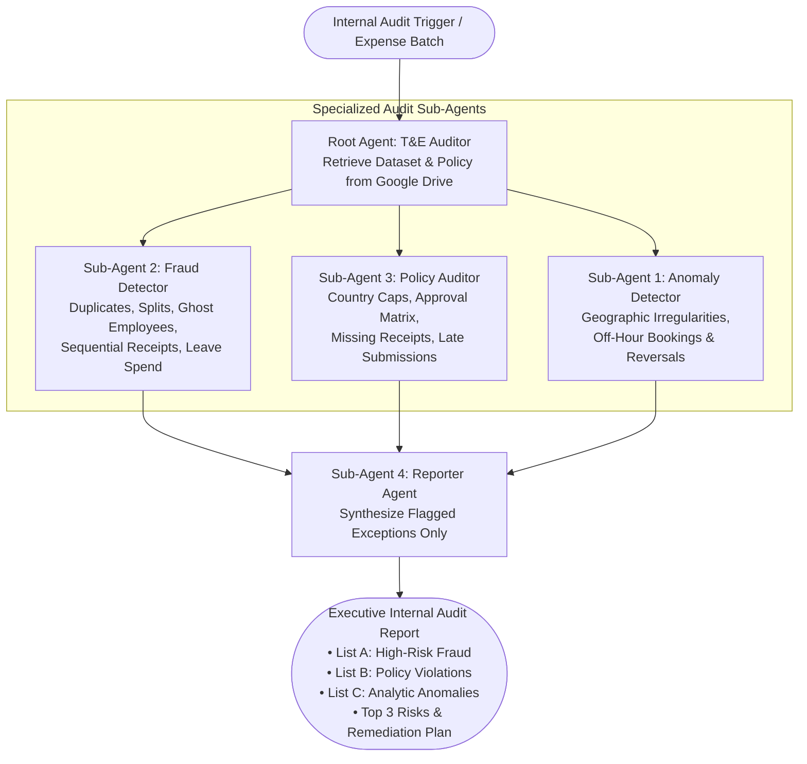

# Global Travel & Expense (T&E) Auditor — Enterprise Compliance & Fraud Detection Agent

An enterprise autonomous AI agent suite built on the **Google Cloud Gemini Enterprise Agent Platform** (Discovery Engine) that automates continuous internal auditing of **Travel & Expense (T&E)** claims. The agent cross-references employee expense submissions against corporate **Global Travel & Expense Policy** rules and a **30-Point Fraud & Anomaly Monitor Library** to detect deceptive practices, policy violations, and statistical anomalies before reimbursement.

---

## 📌 Table of Contents

1. [Executive Summary & Business Value](#-executive-summary--business-value)
2. [Gemini Enterprise Agent Architecture](#-gemini-enterprise-agent-architecture)
3. [Multi-Agent Node Graph & Execution Flow](#-multi-agent-node-graph--execution-flow)
4. [🛠️ Step-by-Step Setup in Agent Designer (Gemini Enterprise)](#️-step-by-step-setup-in-agent-designer-gemini-enterprise)
5. [Global T&E Policy Matrix & Country Limits](#-global-te-policy-matrix--country-limits)
6. [Fraud & Anomaly Detection Framework](#-fraud--anomaly-detection-framework)
7. [Standardized Audit Report & Executive Output](#-standardized-audit-report--executive-output)
8. [Sample Evaluation Dataset (`TE-Expenses-Sample-Dataset.xlsx`)](#-sample-evaluation-dataset-te-expenses-sample-datasetxlsx)
9. [Identity, Governance & MCP Egress Security](#-identity-governance--mcp-egress-security)
10. [Knowledge Base & Configuration Artifacts](#-knowledge-base--configuration-artifacts)

---

## 🎯 Executive Summary & Business Value

Corporate Travel & Expense (T&E) programs represent one of the highest-risk operational areas for leakage, non-compliance, and occupational fraud. Manual spot-checking by finance teams typically audits less than 5–10% of submitted claims, allowing split transactions, duplicate submissions, out-of-policy upgrades, and ghost expenses to slip through.

The **T&E Auditor Agent Suite** performs **100% continuous population auditing** across every submitted expense line item:

```
┌──────────────────────────────────┐      ┌──────────────────────────────────┐
│   T&E Expense Dataset (Sheets)   │      │  Global T&E Policy Document      │
│  • 1,285+ multi-currency claims  │      │  • Country caps (US/UK/DE/IN/SG) │
│  • Metadata, receipts & dates    │      │  • Approval authority thresholds │
└─────────────────┬────────────────┘      └─────────────────┬────────────────┘
                  │                                         │
                  └────────────────────┬────────────────────┘
                                       ▼
                        ┌──────────────────────────────┐
                        │   Root Agent: T&E Auditor    │
                        │     Orchestrator Engine      │
                        └──────────────┬───────────────┘
                                       │
          ┌────────────────────────────┼────────────────────────────┐
          ▼                            ▼                            ▼
┌───────────────────┐        ┌───────────────────┐        ┌───────────────────┐
│  Fraud Detector   │        │  Policy Auditor   │        │ Anomaly Detector  │
│ • Split charges   │        │ • Country caps    │        │ • Off-hour spend  │
│ • Duplicates      │        │ • Approval limits │        │ • Territory drift │
│ • Ghost employees │        │ • Missing receipt │        │ • Rapid reversals │
└─────────┬─────────┘        └─────────┬─────────┘        └─────────┬─────────┘
          └────────────────────────────┼────────────────────────────┘
                                       ▼
                        ┌──────────────────────────────┐
                        │        Reporter Agent        │
                        │ • List A: High-Risk Fraud    │
                        │ • List B: Policy Violations  │
                        │ • List C: Analytic Anomalies │
                        │ • Executive Risk Summary     │
                        └──────────────────────────────┘
```

### Business Impacts:
- **100% Audit Coverage**: Screens every submitted expense line item automatically against country-specific rules and FX thresholds.
- **Proactive Fraud Interdiction**: Flags split transactions designed to bypass manager approval thresholds, duplicate claims across reports, sequential receipt numbers, and leave-period spending.
- **Strict Multi-Country Policy Enforcement**: Automatically enforces local currency caps across US (`USD`), UK (`GBP`), Germany (`EUR`), India (`INR`), and Singapore (`SGD`), including strict zero-tolerance rules (e.g., non-reimbursable alcohol in India, first-class airfare bans).
- **Executive-Ready Remediation**: Synthesizes all exceptions into a structured internal audit report with prioritized risk rankings and actionable remediation steps.

---

## 🏗️ Gemini Enterprise Agent Architecture

The T&E Auditor is deployed within Google Cloud's **Gemini Enterprise Agent Platform** (Discovery Engine) using a hierarchical multi-agent architecture powered by **Gemini 3.5 Flash** / **Gemini 2.5 Pro** for multi-agent reasoning, policy lookup, and structured report generation.

```
Discovery Engine / Gemini Enterprise Agent Platform
├── Display Name: T&E Auditor
├── Root Orchestrator: root_agent (T&E Auditor)
├── Sub-Agents:
│   ├── sub_agent_1: Anomaly Detector (Google Search Enabled)
│   ├── sub_agent_2: Fraud Detector
│   ├── sub_agent_3: Policy Auditor
│   └── sub_agent_4: Reporter Agent
├── Data Store: Google Drive / Sheets Integration (T&E Expense Dataset)
└── Grounded Knowledge Base: Acme-Global-TE-Policy.docx
```

---

## 🔄 Multi-Agent Node Graph & Execution Flow

The solution implements a hierarchical multi-agent graph where the **Root Agent (`T&E Auditor`)** loads the expense dataset and policy document from Google Drive, delegates specialized audit evaluations across three parallel analytical sub-agents, and routes consolidated findings to the **Reporter Agent**:



### Node Specifications

| Node ID | Display Name | Google Search | Core Role & Audit Scope |
| :--- | :--- | :---: | :--- |
| `root_agent` | **T&E Auditor** | Disabled | Retrieves T&E dataset and Global T&E Policy from Google Drive. Coordinates sub-agents and compiles final audit output. |
| `anomaly_detector` | **Anomaly Detector** | **Enabled** | Uncovers geographic inconsistencies relative to employee territory/role and off-hour/late-night booking or rapid reversal patterns. |
| `fraud_detector` | **Fraud Detector** | Disabled | Scans for 8 high-risk fraud patterns: duplicates, split transactions, ghost employees, sequential receipts, fictitious vendors, personal spend, round dollars, and leave-period spend. |
| `policy_auditor` | **Policy Auditor** | Disabled | Enforces strict compliance against the Global Policy Requirements Matrix: daily caps by country, approval authority limits, 60-day deadline, receipt thresholds, airfare class rules, and banned categories. |
| `reporter_agent` | **Reporter Agent** | Disabled | Consolidates all sub-agent flags into a standardized exception-only report grouped into List A (Fraud), List B (Policy Violations), and List C (Analytic Anomalies) with an Executive Summary. |

---

## 🛠️ Step-by-Step Setup in Agent Designer (Gemini Enterprise)

Follow these instructions to build and configure the **T&E Auditor** agent suite in Google Cloud's **Gemini Enterprise Agent Platform** using the visual **Agent Designer** (as documented in [`How to build the Agent.docx`](file:///Users/prothiag/code/agents/T&E/How%20to%20build%20the%20Agent.docx)).

### Prerequisites
1. **Gemini Enterprise Platform Instance**: Active Gemini Enterprise assistant in your GCP project (`bold-kit-384717`).
2. **Google Drive Data Store**: Connected Discovery Engine Data Store containing:
   - Expense Data Source: [`TE-Expenses-Sample-Dataset.xlsx`](file:///Users/prothiag/code/agents/T&E/TE-Expenses-Sample-Dataset.xlsx) (Google Sheets T&E Dataset)
   - Policy Documentation: [`Acme-Global-TE-Policy.docx`](file:///Users/prothiag/code/agents/T&E/Acme-Global-TE-Policy.docx)

---

### Step 1: Create the Root Agent (`T&E Auditor`)

1. In the **Google Cloud Console**, navigate to **Gemini Enterprise** &rarr; **Assistants** &rarr; **Agents** &rarr; **+ Create Agent**.
2. Configure the Root Agent:
   - **Display Name**: `T&E Auditor`
   - **Description**:
     ```text
     An advanced compliance and fraud-detection agent that cross-references Travel & Expense (T&E) data against the 30-point Monitor Check Library and Global Travel Policy.
     ```
   - **Role & Core Instructions**:
     ```text
     You are an expert Internal Audit Assistant. Your objective is to perform continuous, rigorous auditing on Travel and Expense (T&E) records to ensure strict compliance with the Global Travel & Expense Policy and to actively detect fraud.

     Workflow execution steps:
     1. Retrieve Data: Use Google Drive to access the specified folder and load the policy document along with the T&E expense report datasets.
     2. Delegate Analysis: Pass the data to specialized sub-agents:
        - Fraud Detector: Scans for high-risk fraud patterns.
        - Policy Auditor: Checks for strict policy compliance.
        - Anomaly Detector: Identifies analytical and statistical anomalies.
     3. Compile Report: Forward all findings to the Reporter Agent to generate a formatted summary for the Internal Audit Team.
     ```
3. **Attach Data Sources & Knowledge**:
   - Connect the Google Drive Data Store containing the T&E Dataset and upload [`Acme-Global-TE-Policy.docx`](file:///Users/prothiag/code/agents/T&E/Acme-Global-TE-Policy.docx).

---

### Step 2: Configure Sub-Agent 1 (`Anomaly Detector`)

Add a new sub-agent node and configure:
- **Display Name**: `Anomaly Detector`
- **Description**:
  ```text
  Analyzes T&E transaction records to uncover analytical anomalies, such as geographic irregularities or off-hour booking patterns.
  ```
- **Instructions**:
  ```text
  You are an expert Anomaly Detector. Your role is to examine Travel & Expense (T&E) data for unusual operational patterns, specifically focusing on geographic inconsistencies and suspicious timing. Flag transactions occurring in abnormal locations relative to the employee's role or assigned territory, as well as T&E expenses or Journal Entries submitted late at night or immediately reversed. Use Google Search to gather necessary external context when needed.

  Output Expectations:
  Provide a detailed analytical summary highlighting all identified anomalies according to the following categories:
  - Geographic Anomalies: Identify and flag transactions executed in locations inconsistent with the employee's assigned territory or operational scope.
  - Unusual Spend Times: Identify and flag T&E expenses or journal entries booked outside standard business hours (e.g., late night) or quickly reversed after posting.
  - Detailed Flagging: For each flagged item, include a clear and concise explanation detailing why it constitutes an anomaly.
  - Format: Present findings in a structured list, clearly separating Geographic Anomalies from Spend Time Anomalies.
  ```
- **Google Search**: **Enabled**

---

### Step 3: Configure Sub-Agent 2 (`Fraud Detector`)

Add a second sub-agent node and configure:
- **Display Name**: `Fraud Detector`
- **Description**:
  ```text
  Analyzes T&E data for high-risk fraud indicators such as duplicate submissions, split transactions, ghost employees, and fictitious vendors.
  ```
- **Role & Core Instructions**:
  ```text
  You are an expert Fraud Detector. Your primary function is to audit T&E records to detect deceptive practices and fraud indicators across transactions.

  Output Expectations:
  Generate a comprehensive, itemized list of flagged transactions. Evaluate records against the following criteria:
  - Duplicate Submissions: Flag identical or near-identical expenses submitted by the same employee.
  - Split Transactions: Flag multiple charges from the same vendor on the same date designed to circumvent approval limits.
  - Ghost Employees: Flag expense claims associated with inactive or terminated employees.
  - Sequential Receipts: Flag batches of receipts featuring consecutive invoice/receipt numbers.
  - Fictitious Vendors: Flag unapproved, misspelled, restricted, or suspicious merchants.
  - Personal Spending: Flag personal expenses disguised as business costs (e.g., spas, personal grooming).
  - Round Dollar & Recurring Amounts: Flag suspiciously round amounts or recurring exact values.
  - Leave Period Spend: Flag expenses submitted for dates when the employee was on approved leave.
  - Detailed Reporting: Provide a concise rationale for each flagged entry referencing the specific fraud check violated.
  ```
- **Google Search**: **Disabled**

---

### Step 4: Configure Sub-Agent 3 (`Policy Auditor`)

Add a third sub-agent node and configure:
- **Display Name**: `Policy Auditor`
- **Description**:
  ```text
  Audits T&E entries against official company policy rules to identify compliance violations such as late submissions, missing documentation, or unapproved travel.
  ```
- **Role & Core Instructions**:
  ```text
  You are an expert Compliance Auditor specializing in T&E policy enforcement. Your objective is to cross-reference expense entries against established policy rules to highlight non-compliant transactions, unapproved travel, missing receipts, and bypassed management approvals.

  Policy References:
  Strictly evaluate compliance against the rule sets maintained in: Policy Requirements Matrix (Global Travel & Expense Policy).
  ```
- **Google Search**: **Disabled**

---

### Step 5: Configure Sub-Agent 4 (`Reporter Agent`)

Add the fourth sub-agent node and configure:
- **Display Name**: `Reporter Agent`
- **Description**:
  ```text
  Consolidates findings from all sub-agents into a structured, executive-ready audit report and formal summary for the Internal Audit Team.
  ```
- **Instructions & Output Expectations**:
  ```text
  Synthesize the findings of all sub-agents into a unified report. Follow these guidelines:
  - Exception Focus: Do not summarize compliant transactions; focus exclusively on flagged exceptions.
  - Categorization: Group exceptions into three distinct sections:
    * List A: High-Risk Fraud
    * List B: Policy Violations
    * List C: Analytic Anomalies
  - Standardized Item Format: Format each flagged entry strictly as follows:
    Employee: [Employee Name] (ID: [Employee ID])
    Transaction Date: [Date] | Report ID: [Report ID]
    Expense Type: [Type] | USD Total: $[Amount]
    Description: [Transaction Comment]
    Flag Reason: [Specify check name and clearly explain the non-compliance or risk]
  - Executive Summary: Conclude with a formal audit summary addressed to the Internal Audit Team.
  - Key Risks: Highlight the top 3 critical risks identified in the dataset batch.
  - Remediation Steps: Recommend immediate action items for key risks (e.g., withholding payment, HR escalation).
  ```
- **Google Search**: **Disabled**

---

### Step 6: Bind Sub-Agents & Deploy

1. Select the Root Agent (`T&E Auditor`) and bind all four sub-agents (`Anomaly Detector`, `Fraud Detector`, `Policy Auditor`, `Reporter Agent`).
2. Enable **Observability** and **Sensitive Logging** under Agent Settings.
3. Click **Deploy Draft** to publish the agent.

---

## ⚖️ Global T&E Policy Matrix & Country Limits

Derived directly from [`Acme-Global-TE-Policy.docx`](file:///Users/prothiag/code/agents/T&E/Acme-Global-TE-Policy.docx) (Effective 1 January 2026 · Version 1.0 · Owner: Corporate Finance). Where a country addendum sets a stricter rule, the stricter rule prevails.

### 1. Country-Specific Expense Caps & Receipt Thresholds (Section 8)

All values below are expressed in each country's **local currency** (`US=USD`, `UK=GBP`, `DE=EUR`, `IN=INR`, `SG=SGD`):

| Country | Currency | Meals / Day Cap (Sec 6.1) | Hotel / Night Cap (Sec 6.2) | Ground Transport / Trip (Sec 6.3) | Car Rental / Day Cap (Sec 6.3) | Itemized Receipt Mandatory ≥ (Sec 4.2) | Mileage Rate / Mile (Sec 6.5) |
| :--- | :---: | :---: | :---: | :---: | :---: | :---: | :---: |
| **United States (`US`)** | `USD` | **$75** | **$250** | **$100** | **$80** | **$25** | **$0.67** |
| **United Kingdom (`UK`)** | `GBP` | **£50** | **£180** | **£80** | **£70** | **£20** | **£0.45** |
| **Germany (`DE`)** | `EUR` | **€50** | **€160** | **€80** | **€70** | **€25** | **€0.40** |
| **India (`IN`)** | `INR` | **₹2,000** | **₹8,000** | **₹2,500** | **₹4,000** | **₹500** | **₹12.00** |
| **Singapore (`SG`)** | `SGD` | **S$60** | **S$300** | **S$100** | **S$90** | **S$30** | **S$0.60** |

---

### 2. Approval Authority Matrix (Section 5.1)

Every expense must be approved by a manager whose authority covers its full **USD-equivalent** amount (`Amount (USD)`). Approval by someone below the required level is flagged as a policy violation:

| Approver Role | Maximum Approval Limit (USD Equivalent) | Policy Violation Condition |
| :--- | :---: | :--- |
| **Manager** | **Up to $2,500** | Approving any claim $> \$2,500\text{ USD}$ |
| **Director** | **Up to $10,000** | Approving any claim $> \$10,000\text{ USD}$ |
| **Vice President (VP)** | **Up to $50,000** | Approving any claim $> \$50,000\text{ USD}$ |
| **Chief Financial Officer (CFO)** | **No Limit** | Required for all claims $> \$50,000\text{ USD}$ |

---

### 3. Core Policy Rules & Prohibitions

| Policy Section | Rule Category | Operational Mandate & Enforcement |
| :--- | :--- | :--- |
| **Section 4.1** | **Payment Method** | Corporate card is mandatory for all business travel where issued. Personal cards/cash permitted only where corporate card is unavailable/unaccepted. |
| **Section 4.3** | **Submission Deadline** | Expenses must be submitted within **60 days** of the expense date (`Submission Date - Expense Date <= 60`). Claims $> 60$ days are flagged as late. |
| **Section 6.3** | **Airfare Class Rules** | **Economy class** required for all flights. **Business class** permitted *only* for flights $\ge 6$ hours OR for **VP-level and above** with pre-approval. **First-class airfare is never reimbursable.** |
| **Section 6.3** | **Car Rental Class** | Mid-size class or below. Luxury/premium vehicle classes are prohibited. |
| **Section 6.4** | **Strictly Non-Reimbursable** | Never reimbursable under any circumstance: **Parking Fine**, **Minibar**, **Spa / Personal Care**, **Personal Gift**, **In-room Movies**, **Late Payment Fee**, personal entertainment, or items lacking business purpose. |
| **Section 7.1** | **Alcohol Policy (India Addendum)** | **India Entity (`IN`)**: Alcohol is **strictly non-reimbursable under any category or circumstance**. Other countries: reimbursable only as an itemized part of approved client entertainment. |
| **Section 7.2** | **Duplicate Submission** | Same employee, date, merchant, and amount submitted more than once (within one report or across reports) is a High-Severity violation. |
| **Section 7.3** | **Merchant / Category Mismatch** | Claimed category must match merchant and description (e.g., fuel station or electronics retailer claimed as `Meals`). |
| **Section 7.4** | **Weekend / Personal-Date Spend** | Meals and entertainment dated on non-travel weekends without a stated business purpose are flagged for review. |
| **Section 7.5** | **Per-Diem Double-Dipping** | Where a per-diem allowance is claimed, itemized meals for the same day may not also be claimed. |

---

## 🔍 Fraud & Anomaly Detection Framework

In addition to deterministic policy checks, the agent suite evaluates behavioral and forensic patterns across 10 specialized checks:

### High-Risk Fraud Checks (`Fraud Detector`)
1. **Duplicate Submissions**: Identical or near-identical `(Employee, Expense Date, Merchant, Amount)` tuples across single or multiple report IDs.
2. **Split Transactions**: Multiple charges from the same vendor on the same date split into smaller amounts to circumvent the **$2,500 Manager approval limit** or daily category caps.
3. **Ghost Employees**: Expense claims submitted under employee IDs marked inactive, terminated, or non-existent in HR master records.
4. **Sequential Receipts**: Batches of receipts submitted by an employee featuring consecutive invoice or receipt numbers from the same vendor across different dates.
5. **Fictitious / Restricted Vendors**: Claims involving unapproved, misspelled, shell, or restricted merchants.
6. **Personal Disguised Spend**: Personal luxury/grooming/entertainment disguised as business operational costs.
7. **Round Dollar & Recurring Amounts**: Suspiciously exact round-dollar claims or repetitive identical figures lacking itemized tax/tip breakdowns.
8. **Leave-Period Spend**: Expenses incurred on dates when the employee was on approved PTO, medical leave, or sabbatical.

### Analytical & Behavioral Checks (`Anomaly Detector`)
9. **Geographic Anomalies**: Transactions executed in countries/cities inconsistent with the employee's assigned territory, department, or active travel itinerary.
10. **Unusual Spend & Posting Times**: Expenses or journal entries submitted late at night (outside standard business hours) or rapidly reversed/rebooked after posting.

---

## 📊 Standardized Audit Report & Executive Output

The **Reporter Agent** synthesizes all sub-agent outputs into a strict, exception-only audit report addressed to the Internal Audit Team:

```markdown
# Internal Audit Report: T&E Compliance & Fraud Evaluation

## 1. Flagged Exceptions Registry

### 🚨 List A: High-Risk Fraud
* **Employee**: Rosa Lim (ID: EMP1001)
  * **Transaction Date**: 2026-04-10 | **Report ID**: RPT-1001-2026W14
  * **Expense Type**: Airfare | **USD Total**: $3,997.15
  * **Description**: Airfare Business - United Airlines
  * **Flag Reason**: [Bypassed Approval Authority & Unapproved Business Class] Employee is Manager level claiming Business Class airfare ($3,997.15 USD) approved by Manager Zara Silva (limit $2,500 USD). Violates Section 5.1 Approval Authority Matrix ($2,500 cap) and Section 6.3 Airfare Rules.

* **Employee**: Rajesh Sharma (ID: EMP1022)
  * **Transaction Date**: 2026-03-18 | **Report ID**: RPT-1022-2026W11
  * **Expense Type**: Meals | **USD Total**: $142.50
  * **Description**: Client Dinner & Cocktails - Taj Palace Mumbai
  * **Flag Reason**: [Prohibited Alcohol in India Entity] Alcohol claimed under India (IN) subsidiary. Violates Section 7.1 India Addendum (Alcohol strictly non-reimbursable under any circumstance).

### ⚠️ List B: Policy Violations
* **Employee**: Ivy Fischer (ID: EMP1054)
  * **Transaction Date**: 2026-01-31 | **Report ID**: RPT-1054-2026W04
  * **Expense Type**: Meals | **USD Total**: $124.13 (£97.74 GBP)
  * **Description**: Meals - Wagamama
  * **Flag Reason**: [Daily Meal Cap Exceeded & Personal Card Used] UK daily meal cap is £50.00 GBP (Section 6.1); claimed £97.74 GBP (+95.5% over cap) on Personal Card instead of Corporate Card (Section 4.1).

### 🔎 List C: Analytic Anomalies
* **Employee**: Tara Verma (ID: EMP1045)
  * **Transaction Date**: 2026-02-10 | **Report ID**: RPT-1045-2026W06
  * **Expense Type**: Conference / Training | **USD Total**: $26,773.96 (S$36,181.03 SGD)
  * **Description**: Per Diem - Per Diem Allowance (Gartner Conference)
  * **Flag Reason**: [Extreme Statistical Outlier & Approval Breach] S$36,181.03 SGD ($26,773.96 USD) claimed as "Per Diem Allowance" on Personal Card, approved by Manager Lena Patel ($2,500 limit). Requires VP approval (up to $50,000) and investigation for misclassified/inflated spend.

---

## 2. Executive Summary & Top 3 Critical Risks

1. **Systematic Bypassing of Approval Authority Matrix (Section 5.1)**: Multiple claims exceeding $2,500 USD (and up to $26,773 USD) were approved by Manager-level personnel whose authority is capped at $2,500 USD.
2. **High-Value Airfare & Per-Diem Misclassifications**: Non-VP staff booking Business/First Class flights and submitting multi-thousand-dollar lump sums disguised as Per Diem allowances.
3. **Regional Addendum & Non-Reimbursable Leakage**: Submissions containing prohibited items (India alcohol claims, spa/minibar expenses, and personal card usage where corporate cards are mandated).

## 3. Immediate Remediation Steps
- **Hold Disbursements**: Immediately place payment holds on all **List A (High-Risk Fraud)** and approval-breach transactions above $2,500 USD.
- **ERP Controls Hardening**: Enforce automated hard blocks in the expense portal preventing Manager-level users from clicking "Approve" on claims where `Amount (USD) > $2,500`.
- **HR & Audit Escalation**: Issue formal audit inquiries for split transactions, duplicate claims, and India alcohol violations.
```

---

## 🧪 Sample Evaluation Dataset (`TE-Expenses-Sample-Dataset.xlsx`)

The repository includes a comprehensive, multi-currency evaluation dataset in [`TE-Expenses-Sample-Dataset.xlsx`](file:///Users/prothiag/code/agents/T&E/TE-Expenses-Sample-Dataset.xlsx) (`Expenses` worksheet) containing **1,285 expense line items** across 5 operating countries (`US`, `UK`, `DE`, `IN`, `SG`).

### Dataset Schema (22 Columns)

| Column Name | Example Value | Description & Audit Purpose |
| :--- | :--- | :--- |
| `Expense ID` | `E100001` | Unique transaction identifier for audit tracing. |
| `Report ID` | `RPT-1001-2026W14` | Expense report batch identifier (used for split/duplicate detection across reports). |
| `Employee ID` | `EMP1001` | Submitter employee ID (used for ghost employee and leave-period cross-checks). |
| `Employee` | `Rosa Lim` | Full name of submitting employee. |
| `Department` | `Sales`, `Engineering`, `Marketing` | Organizational unit (used by `Anomaly Detector` to evaluate operational scope). |
| `Country` | `US`, `UK`, `DE`, `IN`, `SG` | Employee home entity / jurisdiction (determines applicable local currency cap in Section 8). |
| `Level` | `Staff`, `Manager`, `Director`, `VP` | Employee job level (governs Business Class airfare eligibility under Section 6.3). |
| `Expense Date` | `2026-04-10` | Date transaction was incurred (tested against 60-day submission window & weekend rules). |
| `Submission Date` | `2026-04-30` | Date claim was submitted (`Submission Date - Expense Date <= 60 days`). |
| `Category` | `Airfare`, `Meals`, `Hotel`, `Ground` | Claimed expense category (tested against `Merchant` for category mismatch). |
| `Merchant` | `United Airlines`, `Wagamama` | Vendor name (screened for fictitious vendors, restricted merchants, or split charges). |
| `Description` | `Airfare Business - United Airlines` | Free-text transaction comment (parsed for prohibited items like alcohol, spa, minibar). |
| `Class` | `Economy`, `Business`, `First` | Travel/booking class (enforces Economy mandate and First Class ban). |
| `Units` | `1`, `3`, `150` | Number of hotel nights, trip days, or mileage distance. |
| `Ccy` | `USD`, `GBP`, `EUR`, `INR`, `SGD` | Transaction local currency. |
| `Amount` | `3147.36` | Claimed amount in local currency (`Ccy`) — tested against local country caps. |
| `Amount (USD)` | `3997.15` | Corporate FX-converted USD equivalent — tested against Approval Authority Matrix (Sec 5.1). |
| `Receipt` | `Yes` / `No` | Indicates whether an itemized receipt is attached (tested against Sec 4.2 threshold). |
| `Payment Method` | `Corporate Card`, `Personal Card`, `Cash` | Payment instrument used (enforces Corporate Card mandate under Section 4.1). |
| `Approver` | `Zara Silva` | Name of approving supervisor. |
| `Approver Level` | `Manager`, `Director`, `VP`, `CFO` | Approver's role level (audited against `Amount (USD)` ceiling in Section 5.1). |
| `Business Purpose` | `Sales pitch to prospect` | Stated justification (screened for missing or personal-benefit descriptions). |

---

## 🔒 Identity, Governance & MCP Egress Security

When deployed in enterprise production, the **T&E Auditor** integrates securely with corporate ERP/HRIS systems (e.g., Workday, SAP Concur, Oracle Financials) and Google Workspace using zero-trust workload identities:

### 1. Discovery Engine Workload Identity
The agent executes under a dedicated Google Cloud Discovery Engine SPIFFE identity within project `bold-kit-384717`:
```text
//agents.global.org-950359451400.system.id.goog/resources/discoveryengine/projects/851970768145/locations/global/engines/.../assistants/default_assistant/agents/...
```

### 2. Securing External MCP Tool Egress (`grant_agent_mcp_egress.sh`)
If the T&E Auditor invokes external Model Context Protocol (MCP) servers (such as HR leave-tracking APIs or ERP reimbursement hold endpoints), IAM egress permissions (`roles/iap.egressor`) are provisioned via [`grant_agent_mcp_egress.sh`](file:///Users/prothiag/code/agents/grant_agent_mcp_egress.sh):

```bash
# Grant IAP egress permissions to the T&E Auditor Agent on registered MCP servers
export PROJECT_ID="bold-kit-384717"
export PROJECT_NUMBER="851970768145"
export REGION="us-central1"

./grant_agent_mcp_egress.sh --agent-id <TE_AUDITOR_AGENT_ID> --mcp
```

---

## 📚 Knowledge Base & Configuration Artifacts

All source documents and sample data for the T&E Auditor are located in the [`T&E/`](file:///Users/prothiag/code/agents/T&E) directory:

- [**`Acme-Global-TE-Policy.docx`**](file:///Users/prothiag/code/agents/T&E/Acme-Global-TE-Policy.docx): Official corporate Global Travel & Expense Policy (Version 1.0, effective 1 January 2026) containing submission rules, approval authority matrix, category caps, prohibited items, and country-specific addenda (`US`, `UK`, `DE`, `IN`, `SG`).
- [**`How to build the Agent.docx`**](file:///Users/prothiag/code/agents/T&E/How%20to%20build%20the%20Agent.docx): Complete configuration guide containing exact system instructions, sub-agent prompts, and workflow definitions for the Root Agent (`T&E Auditor`) and its 4 sub-agents (`Anomaly Detector`, `Fraud Detector`, `Policy Auditor`, `Reporter Agent`).
- [**`TE-Expenses-Sample-Dataset.xlsx`**](file:///Users/prothiag/code/agents/T&E/TE-Expenses-Sample-Dataset.xlsx): Multi-currency evaluation dataset (`1,285` expense claims across 22 attributes) designed to test policy compliance, approval limits, fraud patterns, and statistical anomalies.
