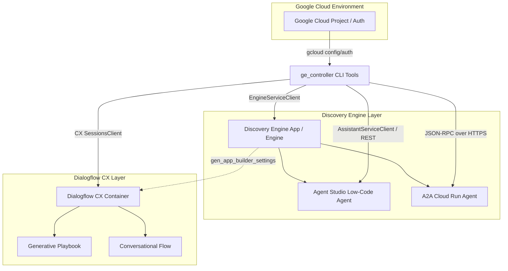

# Gemini Enterprise Controller (`ge_controller`) - Architecture & API Reference

The `ge_controller` suite is a set of Python command-line tools designed to discover, inspect, and interact with Google Cloud Discovery Engine (Vertex AI Agent Builder / Gemini Enterprise) applications and their associated custom or connected agents.

---

## 🏛️ System Architecture Overview

The architecture bridges three primary Google Cloud AI ecosystems:
1. **Discovery Engine Apps (Engines)**: The top-level search, chat, or custom enterprise application containers.
2. **Agent Studio / Agent Designer**: Natively hosted or Cloud Run-backed custom agents embedded directly within the default assistant of a Discovery Engine app.
3. **Dialogflow CX**: Enterprise conversational containers linked to Discovery Engine apps via Gen App Builder engine settings, housing advanced Generative Playbooks and Conversational Flows.

---

## 📦 Detailed File Breakdown & API Usage

### 1. `list_apps.py`
* **Purpose**: Discovers and lists all Gemini Enterprise Apps (Engines) configured within the active Google Cloud project across global and regional locations.
* **APIs & Libraries**: 
  * `google.cloud.discoveryengine_v1.EngineServiceClient`
  * **Method**: `list_engines(parent="projects/{project}/locations/{loc}/collections/default_collection")`
* **Architecture**: Iterates through supported GCP locations (`global`, `us`), instantiates the regional endpoint client, and retrieves engine display names and resource IDs.

### 2. `list_app_agents.py`
* **Purpose**: Inspects a specific Discovery Engine App to enumerate all attached custom agents (Agent Studio/Gallery) and connected Dialogflow CX agents (Playbooks and Flows).
* **APIs & Libraries**: 
  * **Discovery Engine REST API**: Fetches `/v1alpha/{engine_path}/assistants/default_assistant/agents` via `urllib.request` using bearer token authentication.
  * `google.cloud.dialogflowcx_v3.AgentsClient`, `PlaybooksClient`, `FlowsClient`.
* **Architecture**: 
  1. Queries the Discovery Engine alpha REST endpoint to list embedded custom agents and their definitions (`lowCodeAgentDefinition`, `a2aAgentDefinition`).
  2. Scans Dialogflow CX regional locations for agents whose `gen_app_builder_settings.engine` matches the target Discovery Engine app.
  3. For matching CX agents, queries the Playbooks and Flows APIs to list underlying generative and conversational assets.

### 3. `chat_adk_agent.py`
* **Purpose**: Multi-protocol chat CLI designed to interact with Agent Development Kit (ADK) custom agents (A2A protocol) and standard Dialogflow CX agents.
* **APIs & Libraries**: 
  * **Discovery Engine REST API**: Fetches agent metadata to determine if an agent uses `a2aAgentDefinition`.
  * **A2A Protocol (JSON-RPC 2.0)**: Uses `urllib.request` to send JSON-RPC `message/send` payloads over HTTPS directly to Cloud Run microservices.
  * `google.cloud.dialogflowcx_v3.SessionsClient`
* **Architecture**: Evaluates agent definitions dynamically. If an A2A definition is found, it establishes a direct JSON-RPC session with the remote Cloud Run service. Otherwise, it routes the conversation through Dialogflow CX `detect_intent` using a dynamically generated UUID session.

### 4. `chat_agent_studio.py`
* **Purpose**: Single-turn CLI for conversing with natively hosted Agent Studio low-code agents.
* **APIs & Libraries**: 
  * **Discovery Engine REST API**: Extracts the pre-warmed `session` URN from `lowCodeAgentDefinition`.
  * `google.cloud.discoveryengine_v1.AssistantServiceClient`
  * **Method**: `stream_assist(name=assistant_name, query=query, session=session_urn)`
* **Architecture**: Retrieves the pre-warmed session assigned to the low-code agent during deployment, initiates a streaming assist request, and filters the gRPC response stream to output grounded model text answers while suppressing internal model reasoning/thoughts.

### 5. `chat_agent_studio_full_convo.py`
* **Purpose**: Full-conversation interactive terminal CLI for Agent Studio low-code agents.
* **APIs & Libraries**: 
  * `google.cloud.discoveryengine_v1.AssistantServiceClient` (`stream_assist`)
* **Architecture**: Builds on the foundation of `chat_agent_studio.py` by establishing a persistent REPL (`while True:`) loop in the terminal. By continuously passing the exact same pre-warmed `session_urn` across multiple sequential `stream_assist` calls, the Discovery Engine backend automatically tracks and maintains the full multi-turn conversation history.

### 6. `notes.txt`
* **Purpose**: Plaintext reference documentation providing essential setup instructions and quick-copy CLI invocation examples for the entire suite.

---

## 🔑 Authentication & Configuration Layer

All scripts in the suite rely on a common, decoupled authentication mechanism powered by the Google Cloud SDK (`gcloud`):
* `get_gcloud_project()`: Executes `gcloud config get-value project` to dynamically detect the user's active GCP project environment.
* `get_gcloud_access_token()`: Executes `gcloud auth print-access-token` to acquire a short-lived OAuth 2.0 bearer token, ensuring seamless authentication for both gRPC client libraries and raw REST HTTP requests without requiring hardcoded service account keys.
